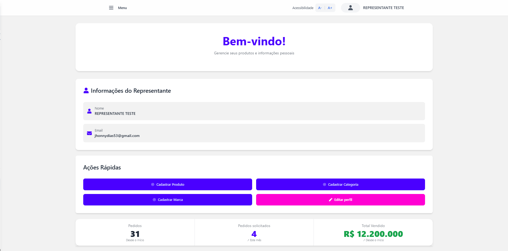
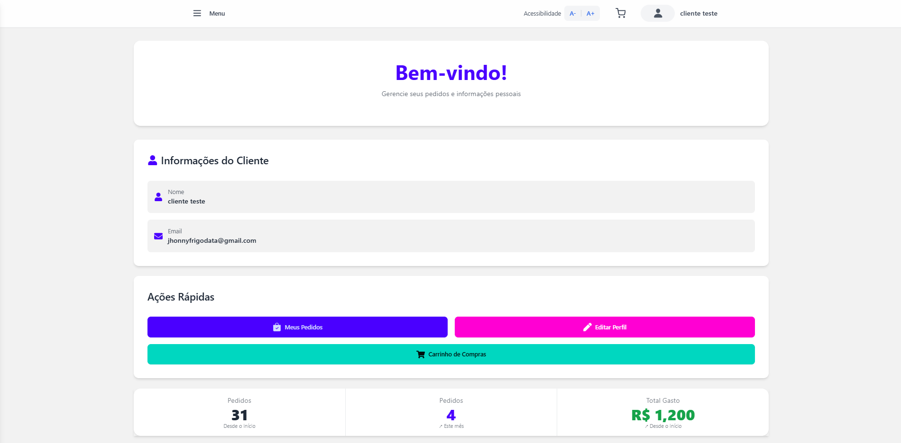

<h1 align="center" style="font-weight: bold;">RepNet 💻</h1>

 <a href="#technologies">Technologies</a> • 

    <b>Commercial Representation System developed in a group during graduation in the Integrative Project discipline, which extends from the first semester until the conclusion of the course. The project is submitted for presentation to an evaluation panel every semester, with the aim of approving each stage. From the beginning, the prototyping, documentation and complete system implementation steps are carried out, covering essential topics that must be implemented according to the requirements of each semester.</b>

     <a href="https://repnet.tec.br" target="_blank"
              rel="noopener noreferrer">📱 Visit the Website</a>

<h2 id="layout">🎨 Layout</h2>

    
    

<h2 id="technologies">💻 Technologies</h2>

- Next.js 14.2.3
- React 18
- React Hook Form
- Axios
- TailwindCSS
- DaisyUI
- TypeScript
